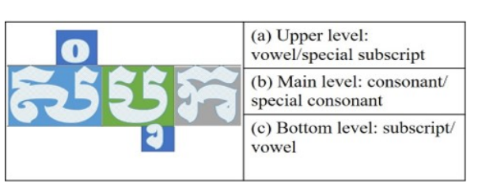
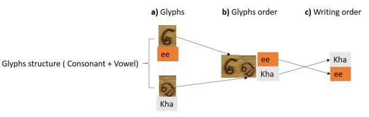
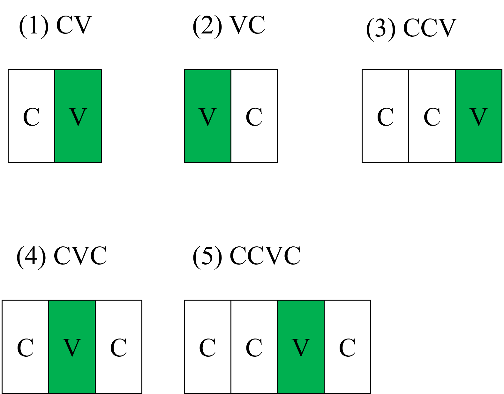
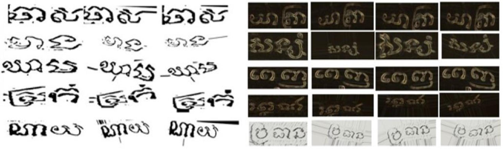
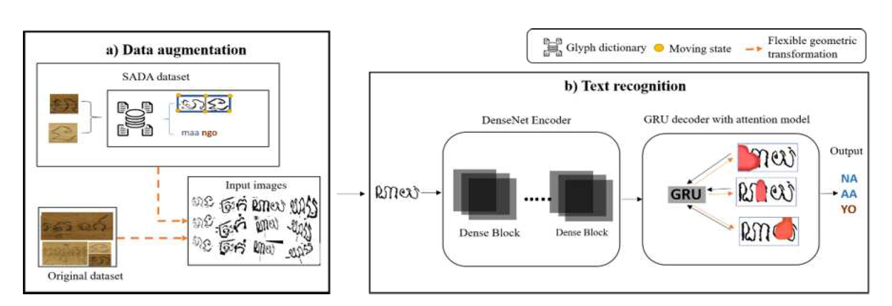
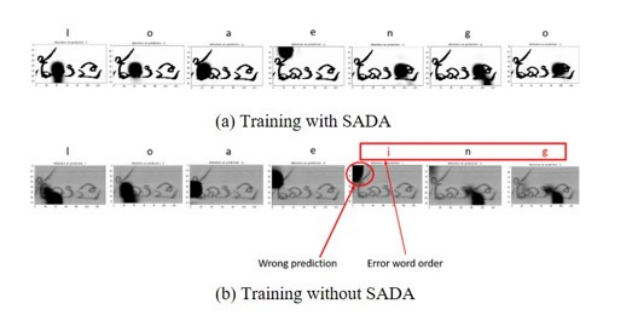
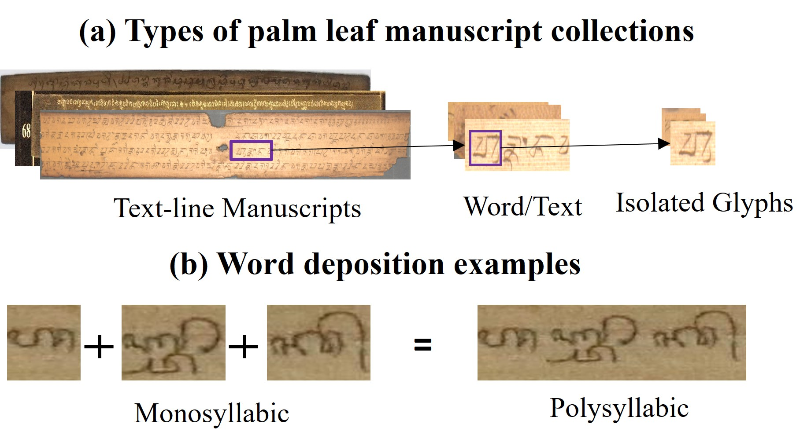
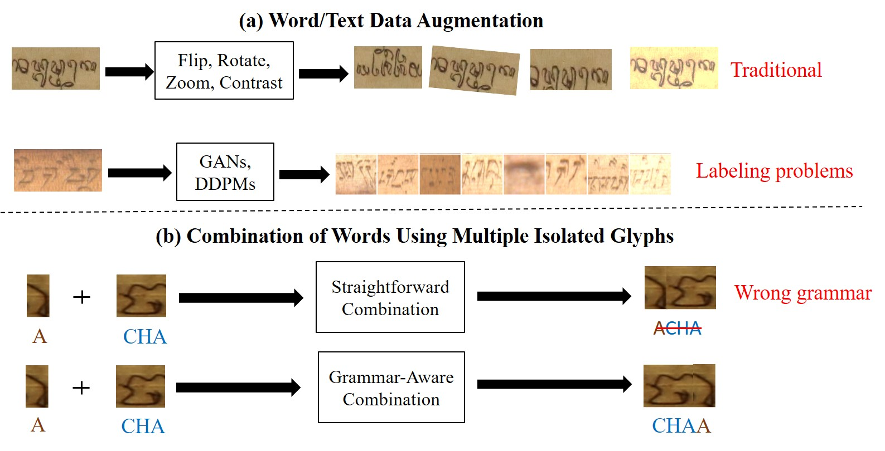

# Syllable Analysis Data Augmentation (SADA)

### This repository supports two research projects focused on text recognition for ancient Southeast Asian scripts. 
### (**One of these approaches won First Place in Text Recognition Tasks at ICFHR 2018 for Palm Leaf Manuscript Analysis.** )

### Additionally, the projects incorporate syllable-based data augmentation. These efforts aim to enhance recognition systems for palm leaf manuscripts by integrating linguistic grammar into visual recognition models.


---

## 📄 Papers

- **Paper 1:** *Khmer Syllable Analysis Data Augmentation (KH-SADA)* 
- **Paper 2:** *Multi-Low Resource Languages Syllable Analysis Data Augmentation (PALM-SADA)* (Under Review – *Pattern Recognition Letters*)

---

## Paper 1: KH-SADA – Khmer Syllable Analysis Data Augmentation

### 🧠 Introduction

This project introduces a glyph dictionary and grammar-aware augmentation strategy designed to enhance Khmer palm leaf manuscript recognition. By modeling the language's grammatical structure, we support more robust OCR performance in low-resource settings.

<p align="center">
  
</p>
<p align="center"><em>Figure 1: Complexity of a Khmer word with stacked consonants and multiple diacritics.</em></p>

### 🗂️ Background

Inspired by publicly available datasets from the ICFHR 2018 competition, we built this dictionary to capture essential grammar forms of Khmer syllables. This linguistic grounding is critical for generating valid word formations and improving recognition accuracy.

<p align="center">
  
</p>
<p align="center"><em>Figure 2: Complexity of Khmer grammar structure with syllabic combinations and contextual glyph roles.</em></p>

### 📦 Repository Contents

- **Khmer Grammar Structures**  
  Core grammar forms (CV, CVC, etc.) used in valid word formations.

- **Glyph Classes & Types**  
  Categorized glyphs (e.g., base consonants, subscripts, vowels) to facilitate structured augmentation.

<p align="center">
  
</p>
<p align="center"><em>Figure 3: Component breakdown of Khmer writing forms, including consonants and dependent vowels.</em></p>

- **Ground Truth Training Data**  
  Labeled glyph image dataset used for training and evaluation.

- **Latin Transliterated Dictionary**  
  Mapping of Khmer glyphs to Latin script for cross-linguistic comparison.

- **Baseline Recognition System (DenseNet + GRU)**  
  Implementation and results of our ICFHR 2018-winning model using DenseNet and GRU.

### 🔁 Syllable-Based Augmentation

Our augmentation module simulates realistic glyph combinations using grammar constraints. It improves model generalization by introducing diverse and syntactically valid examples.

<p align="center">
  
</p>
<p align="center"><em>Figure 4: Example of syllable-based data augmentation using grammar-aware synthesis.</em></p>

### 🔍 Recognition

Our recognition module utilizes an attention-based architecture to interpret complex Khmer syllables from palm leaf manuscripts. The system highlights which regions of the glyph sequence are most influential during the prediction process, offering insights into both accurate results and common failure cases.

<p align="center">
  
</p>
<p align="center"><em>Figure 5: Visualization of the full KH-SADA pipeline with attention-based recognition and syllable-level interpretation.</em></p>

<p align="center">
  
</p>
<p align="center"><em>Figure 6: Attention-based recognition result visualizations on Khmer palm leaf manuscript text.</em></p>

### 📥 Downloads

- **Pre-trained Model Weights**  
  [Download Weights](https://drive.google.com/file/d/15km1riGn19twubZQoGFhvfsXFphGJP1R/view?usp=sharing)

- **Dataset**  
  [Download Dataset](https://drive.google.com/drive/folders/16-mLPE8QSGB4-tKpUS2q7_V2L-VgjVhi?usp=sharing)

---


##  Paper 2: PALM-SADA – Multi-Low Resource Languages Syllable Analysis Data Augmentation

> **Status:** Under review at *Pattern Recognition Letters*

This paper extends our work from KH-SADA to **multi-script analysis**, including **Khmer, Balinese, and Sundanese**. It introduces a grammar-aware augmentation framework for multi-script palm leaf manuscripts and an improved recognition architecture.

PALM-SADA presents a unified grammar-aware data augmentation and error analysis framework for palm leaf manuscript recognition, targeting low-resource Southeast Asian scripts. This project builds on our previous KH-SADA work for Khmer, now extending to multi-script analysis with Khmer, Balinese, and Sundanese.


**PALM-SADA** introduces a grammar-aware data augmentation and error analysis framework for palm leaf manuscript recognition, focusing on **low-resource Southeast Asian scripts**. This work extends our previous KH-SADA project for Khmer to **multi-script analysis**, covering **Khmer, Balinese, and Sundanese**.

PALM-SADA fuses linguistic rules with deep learning architectures to improve recognition accuracy and provide in-depth error analysis for underrepresented scripts.

### 🌐 Key Contributions

- 📖 **Unified Grammar-Aware Augmentation**: A modular augmentation pipeline tailored for syllable structures across Khmer, Balinese, and Sundanese scripts.
- 🔡 **Syllable-Level Glyph Generation**: Incorporates script-specific grammar constraints into synthetic data generation for robust model training.
- 🧠 **Improved Recognition Architecture**: Integrates transformer-based models and attention modules adapted to multi-script features.
- 🔍 **Error Analysis Framework**: Highlights recognition weaknesses by script and structure, enabling fine-grained evaluation of model behavior.

### 📸 Visual Highlights

<p align="center">
  
</p>
<p align="center"><em>Figure 1: Example of monosyllabic and polysyllabic  word compositions in Southeast Asian scripts.</em></p>

<p align="center">
  
</p>
<p align="center"><em>Figure 2: Comparison between naive glyph combination (top) and grammar-aware composition with writing-awareness (bottom).</em></p>

---

### Next update: Coming soon..


## Conclusion

This glyph dictionary serves as a foundational resource for researchers and developers working on text recognition in low-resource scripts. By integrating grammatical structures and providing a rich, linguistically-informed dataset, we aim to support the advancement of Khmer palm leaf manuscript recognition.

We welcome feedback, collaboration, and contributions to further enhance the tools and resources available for historical text recognition and classification. Thank you for your interest and support!

---
## 📖 Reference

If you use this work, please cite the following publications:
```bibtex
@INPROCEEDINGS{9980217,
  author    = {Thuon, Nimol and Du, Jun and Zhang, Jianshu},
  title     = {Syllable Analysis Data Augmentation for Khmer Ancient Palm Leaf Recognition},
  booktitle = {2022 Asia-Pacific Signal and Information Processing Association Annual Summit and Conference (APSIPA ASC)},
  year      = {2022},
  pages     = {1855--1862},
  doi       = {10.23919/APSIPAASC55919.2022.9980217},
  keywords  = {Training; Dictionaries; Image recognition; Text recognition; System performance; Information processing; Feature extraction},
  publisher = {IEEE}
}

@article{thuon2025multi,
  title     = {Multi-low resource languages in palm leaf manuscript recognition: Syllable-based augmentation and error analysis},
  author    = {Thuon, Nimol and Du, Jun and Theang, Panhapin and Thuon, Ranysakol},
  journal   = {Pattern Recognition Letters},
  year      = {2025},
  publisher = {Elsevier}
}


